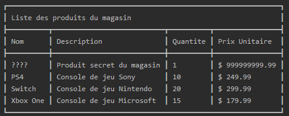
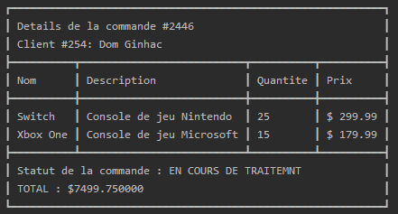

# ITC313-TP2
L'application EASYSHOP Facilite votre vie et vous permet de devenir au moins aussi riche que Elon Musk !  
Grâce à son ingénieux système de gestion de commerce, vous pourrez créer votre propre magasin :

* Clients
	* Ajouter un client
	* Modifier un client
	* Afficher tous les clients
	* Afficher un client grâce à son nom
	* Afficher un client grâce à son ID
* Commandes
	* Ajouter une commande
	* Afficher toutes les commandes passées
	* Afficher une commande grâce à son ID
	* Afficher toutes les commandes d'un certain client
* Produits
	* Ajouter un produit
	* Modifier un produit
	* Afficher tous les produits du magasins
	* Afficher les détails d'un produit grâce à son nom

Et tout cela grâce à un menu simple et intuitif !

## Groupe de travail
* Jonathan LIGNIER
* Valentin JOLY

## Crédits
* Classe ConsoleTable crée par 766F6964 [lien Github](https://github.com/766F6964/ConsoleTable)
	* adapatée à notre projet pour l'affichage des tableaux de manière **très propre** et dynamique

	 
## Avancée du projet

### Question 1 : Création de la classe Magasin
- [x] 1.a) Créer la classe Magasin avec ses 3 variables membres, son constructeur

- [x] 1.b) Ecrire un programme principal permettant de créer un objet (vide) de type magasin.

### Question 2 : Création de la classe Produit
- [x] 2.a) Créer la classe Produit avec ses variables membres, son constructeur et ses fonctions getters. Ajouter une méthode permettant de modifier la quantité disponible.

- [x] 2.b) Surcharger l'opérateur << pour pouvoir afficher un produit.

### Question 3 : Ajout de fonctionnalités à Magasin
- [x] 3.a) Ajouter à la classe Magasin une méthode permettant d'ajouter un nouveau produit au magasin.

- [x] 3.b) Ecrire une méthode permettant d'afficher à l'écran tous les produits référencés dans le magasin.

- [x] 3.c) Ecrire une méthode permettant d'afficher à l'écran un produit sélectionné par son nom.

- [x] 3.d) Ecrire une méthode permettant de mettre à jour la quantité d'un produit sélectionné par son nom.

### Question 4 : Création de la classe Client
- [x] 4.a) Créer la classe Client avec ses variables membres (identifiant, prenom, nom, panier d'achat) et ses fonctions getters.

- [x] 4.b) Ajouter une méthode permettant d'ajouter un produit au panier d'achat.

- [x] 4.c) Ajouter une méthode permettant de vider le panier d'achat.

- [x] 4.d) Ajouter une méthode permettant de modifier la quantité d'un produit ajouté au panier d'achat

- [x] 4.e) Ajouter une méthode permettant de supprimer un produit du panier d'achat.

- [x] 4.f) Surcharger l'opérateur << pour pouvoir afficher toutes les informations du client (incluant les produits du panier d'achat.

### Question 5 : Ajout de fonctionnalités à Magasin
- [x] 5.a) Ajouter à la classe Magasin une méthode permettant d'ajouter un nouveau client au magasin.

- [x] 5.b) Ecrire une méthode permettant d'afficher à l'écran tous les clients du magasin.

- [x] 5.c) Ecrire une méthode permettant d'afficher à l'écran un client sélectionné par son nom ou son identifiant.

- [x] 5.d) Ecrire une méthode permettant d'ajouter un produit au panier d'achat d'un client.

- [x] 5.e) Ecrire une méthode permettant de supprimer un produit au panier d'achat d'un client.

- [x] 5.f) Ecrire une méthode permettant de modifier la quantité d'un produit du panier d'achat d'un client.

### Question 6 : Création de la classe Commande
- [x] 6.a) Créer la classe Commande avec ses variables membres (client, produits achetés, statut).

- [x] 6.f) Surcharger l'opérateur << pour pouvoir afficher toutes les informations de la commande.

### Question 7 : Ajout de fonctionnalités à Magasin
- [x] 7.a) Ajouter à la classe Magasin une méthode permettant de valider une commande

- [x] 7.b) Ajouter une méthode permettant de mettre à jour le statut d'une commande

- [x] 7.c) Ajouter une méthode permettant d'afficher toutes les commandes passées.

- [x] 7.d) Ajouter une méthode permettant d'afficher toutes les commandes d'un client donné.

### Question 8 : Questions subsidiaires
- [ ] 8.a) Dans le programme principal, créer un menu permettant de sélectionner l'action à faire : gestion du magasin, gestion des utilisateurs, gestion des commandes. Pour chacun des actions, créer un sous menu avec les options correspondantes. Par exemple, pour gestion du magasin, ajouter les commandes : ajout d'un produit, affichage des produits, mise a jour des quantités, …

- [ ] 8.b) Ecrire le code nécessaire à l'enregistrement et à la lecture des données (produits, clients et commandes) dans des fichiers.
